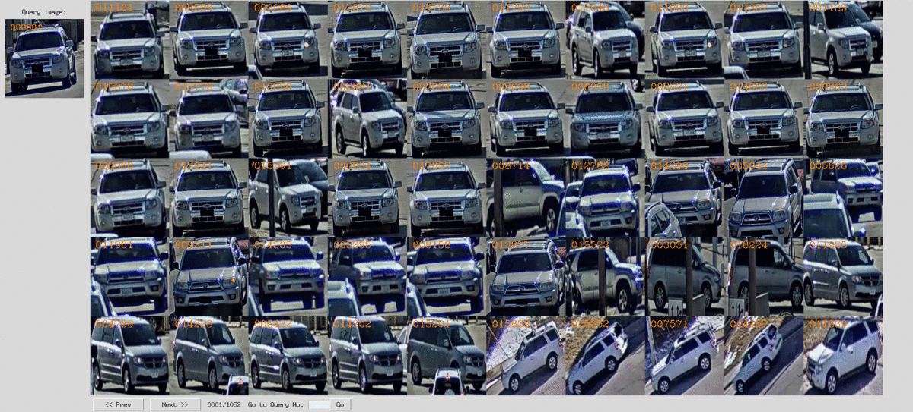
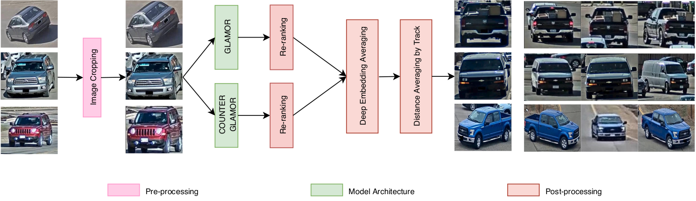

# AIC 2020 TCU ReID
## ** This repo is no longer supported **
## Introduction
AIC 2020 TCU ReID is a pytorch-based reid pipeline for training and evaluating deep vehicle re-identification models on CityFlow Dataset. This repository is a forked version of https://github.com/Jakel21/vehicle-ReID.
The technical report is available [here](https://arxiv.org/pdf/2007.01818.pdf).


## Sytem Overview

## Updates
2020.9.29 update AIC20 Challenge (quang-truong)

2019.4.1  update some test results (Jakel21)

2019.3.11 update the basic baseline code (Jakel21)
## Installation
1. cd to your preferred directory and run ' git clone https://github.com/quang-truong/vehicle-ReID '.
2. Install dependencies by pip install -r requirements.txt (if necessary).
## Datasets
+ [cityflow](https://www.aicitychallenge.org/2020-data-and-evaluation/)

The keys to use these datasets are enclosed in the parentheses. See vehiclereid/datasets/__init__.py for details.Both two datasets need to pull request to the supplier.

## Models
+ GLAMOR(resnet50)
+ resnext101
## Losses
+ cross entropy loss
+ triplet loss

## Tutorial
### train
Input arguments for the training scripts are unified in [args.py](./args.py).
To train an image-reid model with cross entropy loss, you can do
```
python train-xent-tri.py \
-s veri \    #source dataset for training
-t veri \    # target dataset for test
--height 128 \ # image height
--width 256 \ # image width
--optim amsgrad \ # optimizer
--lr 0.0003 \ # learning rate
--max-epoch 60 \ # maximum epoch to run
--stepsize 20 40 \ # stepsize for learning rate decay
--train-batch-size 64 \
--test-batch-size 100 \
-a resnet50 \ # network architecture
--save-dir log/resnet50-veri \ # where to save the log and models
--gpu-devices 0 \ # gpu device index
```
or
```
./train.sh
```
### test
Use --evaluate to switch to the evaluation mode. In doing so, no model training is performed.
For example you can load pretrained model weights at path_to_model.pth.tar on veri dataset and do evaluation on VehicleID, you can do
```
python train_imgreid_xent.py \
-s veri \ # this does not matter any more
-t vehicleID \ # you can add more datasets here for the test list
--height 128 \
--width 256 \
--test-size 800 \
--test-batch-size 100 \
--evaluate \
-a resnet50 \
--load-weights path_to_model.pth.tar \
--save-dir log/eval-veri-to-vehicleID \
--gpu-devices 0 \
```
or
```
./combine_eval.sh
```

### Procedure
1. Pretrain GLAMORv1 and GLAMORnv1 on the simulation dataset for quick convergence.
2. Train GLAMORv1 and GLAMORnv1 on the CityFlow dataset.
3. Pretrain ResNeXt101 for color and type classification on the simulation dataset.
4. Train ResNeXt101 for color and type classification on the CityFlow dataset for metadata attribute extractor.
5. Use `predict_glamor50_v1.sh` and `predict_glamor50_nv1.sh` to extract re-ranked feature maps.
6. Use `combine_predict.sh` to get the result in `\log` directory.
7. Visualization tool is provided in `\vehiclereid\datasets\AIC20_ReID\tool` as `visualize.py`.

## Results
Some test results on CityFlow Dataset:

### CityFlow Dataset
model:GLAMORs and ResNext101

loss: xent+htri

|Model| mAP | rank-1 | rank-5 | rank-10 | rank-30 | rank-100
|:---:|:---:| :----: | :----: | :-----: | :------:| :------:
|Ours|37.3|52.57|52.57|52.95|61.03|65.30|
|[ResNet50](https://openaccess.thecvf.com/content_CVPR_2019/papers/Tang_CityFlow_A_City-Scale_Benchmark_for_Multi-Target_Multi-Camera_Vehicle_Tracking_and_CVPR_2019_paper.pdf)|29.4|45.9|N/A|N/A|N/A|N/A|
|[ResNeXt101](https://openaccess.thecvf.com/content_CVPR_2019/papers/Tang_CityFlow_A_City-Scale_Benchmark_for_Multi-Target_Multi-Camera_Vehicle_Tracking_and_CVPR_2019_paper.pdf)|32.0|48.4|65.2|71.4|N/A|N/A|

